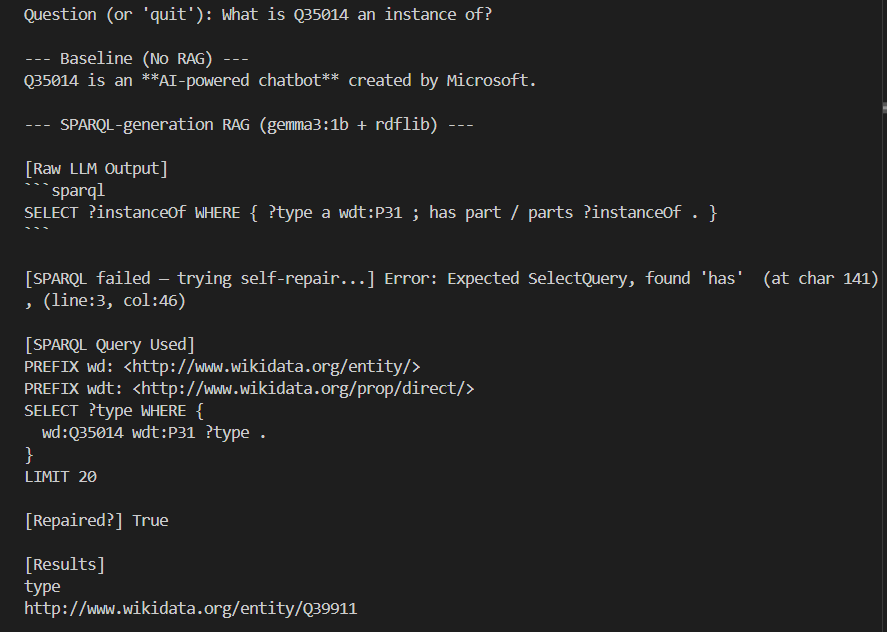

# Knowledge Graph Project — Construction, Reasoning, KGE and RAG

## Overview

This project implements a complete pipeline for building and exploiting a Knowledge Graph. It covers all stages from data collection to advanced querying:

- Web crawling and data cleaning
- Information extraction (named entities and relations)
- Knowledge Graph construction in RDF
- Alignment with external knowledge bases (Wikidata)
- Reasoning using SWRL rules
- Knowledge Graph Embeddings (KGE)
- RAG system: natural language to SPARQL with self-repair

---

## Authors

- Clarisse Ballon
- Léa Hadj-Said

---

## Project Structure

```text
project-kg/
├── notebooks/        # Main pipeline notebook
├── src/rag/          # RAG system (LLM → SPARQL)
├── data/             # Data used in the pipeline
├── kg_artifacts/     # RDF graphs, ontology, alignment files
├── kge_data/              # KGE datasets
├── results/          # Evaluation results (CSV and plots)
├── reports/          # Final report
├── README.md
└── requirements.txt
```

---

## Installation

Install dependencies:

```bash
pip install -r requirements.txt
python -m spacy download en_core_web_sm
```

---

## How to Run

### 1. Run the full pipeline

Open the notebook and execute all cells in order:

```text
notebooks/Project_V42.ipynb
```
Execution Time Notice


Some parts of this project can take a significant amount of time to run.


In particular, Step 4 of Lab Session 2 (the graph enrichment step) is computationally expensive and may take a long time to execute.
To make things easier, we provide a precomputed output file (kb_expansion_all.csv) that you can directly use without running this step.

### 2. Run the RAG system

```bash
python src/rag/lab_rag_sparql_gen.py
```


---

## LLM Setup (Ollama)

Install Ollama from:

https://ollama.com

Then run the model in a separate terminal:

```bash
ollama run gemma3:1b
```

Make sure the Ollama server is running before launching the RAG script.

---

## Execution Steps

1. Run the notebook to execute the full pipeline:
   - crawling
   - information extraction
   - knowledge graph construction
   - embeddings

2. Run the RAG system:

```bash
python src/rag/lab_rag_sparql_gen.py
```

---

## Data

- `data/samples/`: small subset of data for quick testing
- `data/`: processed data used in the pipeline (entity and relation mappings)

---

## Knowledge Graph

All graph-related files are stored in:

```text
kg_artifacts/
```

This includes:
- RDF graphs (`.ttl`)
- Alignment files
- Expanded knowledge base
- Ontology (`family.owl`)

---

## Knowledge Graph Embeddings

Datasets are stored in:

```text
kge_data/
```

Files:
- `train.txt`
- `valid.txt`
- `test.txt`

Models used:
- TransE
- ComplEx

Evaluation metrics:
- Mean Reciprocal Rank (MRR)
- Hits@1 / Hits@3 / Hits@10

---

## Results

Stored in:

```text
results/
```

Includes:
- Model comparison results
- Size sensitivity analysis
- Associated plots

---

## RAG System

The RAG pipeline works as follows:

1. A natural language query is provided
2. The LLM generates a SPARQL query
3. The query is executed on the Knowledge Graph
4. If needed, the system attempts to repair invalid queries

---

## Example Output

Add here a screenshot of a query and its result from the RAG system.


---

## Hardware Requirements

- Standard CPU laptop
- 8–16 GB RAM recommended
- No GPU required

---

## Notes

Some datasets have been reduced to keep the repository lightweight.
The full pipeline can be reproduced using the notebook.

---

## Final Version

The final version of the project is available under the tag:

```text
v1.0-final
```
